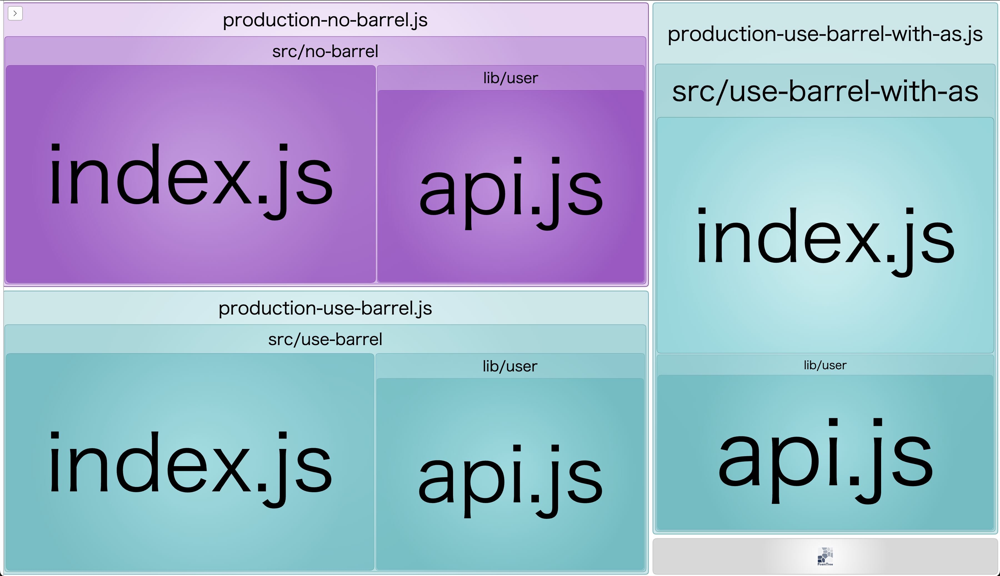

# barrel-bundle-test

This repository shows the result of the build using barrel or not using barrel.

Webpack build log:

## Development


```
asset development-use-barrel.js 11.3 KiB [compared for emit] (name: use-barrel)
asset development-use-barrel-with-as.js 11.1 KiB [compared for emit] (name: use-barrel-with-as)
asset development-no-barrel.js 7.58 KiB [compared for emit] (name: no-barrel)
runtime modules 8.12 KiB 12 modules
cacheable modules 1.65 KiB
  modules by path ./src/use-barrel/ 661 bytes
    modules by path ./src/use-barrel/lib/post/*.js 262 bytes 2 modules
    modules by path ./src/use-barrel/lib/user/*.js 262 bytes 2 modules
    ./src/use-barrel/index.js 91 bytes [built] [code generated]
    ./src/use-barrel/lib/index.js 46 bytes [built] [code generated]
  modules by path ./src/use-barrel-with-as/ 688 bytes
    modules by path ./src/use-barrel-with-as/lib/post/*.js 273 bytes 2 modules
    modules by path ./src/use-barrel-with-as/lib/user/*.js 273 bytes 2 modules
    ./src/use-barrel-with-as/index.js 96 bytes [built] [code generated]
    ./src/use-barrel-with-as/lib/index.js 46 bytes [built] [code generated]
  modules by path ./src/no-barrel/ 340 bytes
    ./src/no-barrel/index.js 100 bytes [built] [code generated]
    ./src/no-barrel/lib/user/api.js 240 bytes [built] [code generated]
webpack 5.92.1 compiled successfully in 75 ms
```

## Production



```
asset production-no-barrel.js 1.43 KiB [compared for emit] [minimized] (name: no-barrel)
asset production-use-barrel.js 1.43 KiB [compared for emit] [minimized] (name: use-barrel)
asset production-use-barrel-with-as.js 1.43 KiB [compared for emit] [minimized] (name: use-barrel-with-as)
runtime modules 7.31 KiB 9 modules
orphan modules 682 bytes [orphan] 8 modules
cacheable modules 1010 bytes
  modules by path ./src/no-barrel/ 340 bytes
    ./src/no-barrel/index.js 100 bytes [built] [code generated]
    ./src/no-barrel/lib/user/api.js 240 bytes [built] [code generated]
  modules by path ./src/use-barrel/ 331 bytes
    ./src/use-barrel/index.js 91 bytes [built] [code generated]
    ./src/use-barrel/lib/user/api.js 240 bytes [built] [code generated]
  modules by path ./src/use-barrel-with-as/ 336 bytes
    ./src/use-barrel-with-as/index.js 96 bytes [built] [code generated]
    ./src/use-barrel-with-as/lib/user/api.js 240 bytes [built] [code generated]
webpack 5.92.1 compiled successfully in 220 ms
```

The result of the build is in `dist` folder :)
